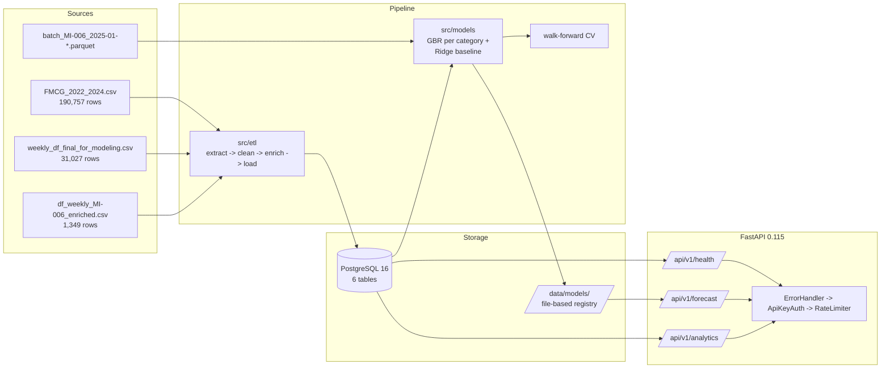

# FMCG Demand Forecasting & Product Intelligence Platform

[](https://github.com/Millefeuille77/ML-pipeline/actions/workflows/ci.yml)
[](LICENSE)
[](https://www.python.org/downloads/release/python-3120/)

A portfolio-grade Python + SQL + AI/ML system that forecasts weekly SKU
demand, clusters products by demand behavior, detects supply/demand
anomalies, and exposes everything via a secured REST API backed by
PostgreSQL — built against real FMCG distribution data covering 30 SKUs,
5 categories, 3 channels, 3 regions, and 190,000+ daily transactions
across 2022–2024. The project targets the operational reality at
**KNS Group** (kns.asia): SKU-level weekly replenishment, multi-channel
trade promotions, and short-shelf-life category management.

---

## Architecture



---

## Dataset overview

| File                                     | Rows    | Granularity     | Purpose                            |
|------------------------------------------|---------|-----------------|------------------------------------|
| `FMCG_2022_2024.csv`                     | 190,757 | Daily           | Raw fact table                     |
| `weekly_df_final_for_modeling.csv`       | 31,027  | Weekly, all SKUs| Model training                     |
| `df_weekly_MI-006_enriched.csv`          | 1,349   | Weekly (MI-006) | Enrichment template                |
| `batch_MI-006_2025-01-{06,13,20,27}.parquet` | ~50 each | Weekly batches  | Batch inference simulation         |

- **30 SKUs** across **14 brands** and **13 segments**
- **5 categories** — Milk (7), Yogurt (10), ReadyMeal (5), Juice (1), SnackBar (6)
- **3 channels** — Retail, Discount, E-commerce
- **3 regions** — PL-Central, PL-North, PL-South
- **3 pack types** — Multipack, Single, Carton
- Date range: **2022-01-21 → 2024-12-31** (daily) / **2022-02-14 → 2024-12-23** (weekly)
- Negative `units_sold` and `delivered_qty` are valid (returns) — preserved end-to-end

---

## Features

- **Weekly demand forecasting** — per-category Gradient Boosting Regressor
  with quantile prediction intervals at q=0.1 / q=0.9, plus a Ridge baseline
- **Product clustering** — K-Means over 30 SKUs, sweeping k=3..6 with
  silhouette selection and human-readable cluster labels
- **Anomaly detection** — six statistical rules (demand spikes, drops,
  return anomalies, stock risk, price moves, promo cannibalization)
- **Batch prediction** — parquet-driven weekly batches simulate production
  inference and persist to `batch_predictions`
- **Analytics** — sales summary, top products, inventory risk, category
  trends, lifecycle distribution, channel comparison
- **EDA notebook** — `notebooks/eda_exploration.ipynb` with portfolio-grade
  charts (matplotlib only)
- **Walk-forward evaluation** — temporal-only validation with MAPE / RMSE /
  MAE / R² metrics and a GBR-vs-Ridge comparison report

---

## Tech stack (and why)

| Layer            | Package                       | Why this choice                                                                                  |
|------------------|-------------------------------|--------------------------------------------------------------------------------------------------|
| Web framework    | `fastapi==0.115.0`            | Pydantic-native, async-friendly, OpenAPI out of the box                                          |
| ASGI server      | `uvicorn==0.30.0`             | Standard FastAPI runner; minimal footprint                                                       |
| ORM / SQL        | `sqlalchemy==2.0.35`          | Parameterized SQL with first-class typing; no auto-magic ORM tax                                 |
| Postgres driver  | `psycopg2-binary==2.9.9`      | Mature, fast bulk inserts via `execute_values`                                                   |
| DataFrames       | `pandas==2.2.3`               | Tabular weekly data, ~31k rows — pandas is the right granularity                                 |
| Numerics         | `numpy==1.26.4`               | Underlying array ops for pandas + scikit-learn                                                   |
| ML               | `scikit-learn==1.5.2`         | **GBR over LSTM** — 150 timesteps per series is too short for sequence models; tabular wins      |
| Validation       | `pydantic==2.9.0`             | Single source of truth for API + dataset contracts                                               |
| Settings         | `pydantic-settings==2.5.0`    | Typed settings from `.env`, lru-cached                                                           |
| .env loader      | `python-dotenv==1.0.1`        | Required by pydantic-settings                                                                    |
| Model serialization | `joblib==1.4.2`            | Faster than pickle for sklearn estimators                                                        |
| Parquet I/O      | `pyarrow==18.0.0`             | Required for batch parquet inference                                                             |

**Notable omissions:** no Redis (in-memory sliding-window rate limiter is
sufficient at this scale), no Celery/Kafka (no async pipeline needs),
no TensorFlow/PyTorch/Keras (overkill for tabular weekly data —
GBR matches accuracy with 10× faster training).

---

## Setup

### Docker (preferred)

```bash
cp .env.example .env                       # then edit secrets
docker compose up --build
```

This starts PostgreSQL 16 and the API on port 8000. Health check at
`http://localhost:8000/api/v1/health`.

After services are up, run the data loader:

```bash
docker compose exec app python -m src.database.init_db
```

### Bare metal

```bash
python -m venv .venv
source .venv/bin/activate                  # Windows: .venv\Scripts\activate
pip install -r requirements-dev.txt
cp .env.example .env                       # then edit secrets
python -m src.database.init_db             # loads CSV/parquet into Postgres
uvicorn src.main:app --reload              # http://localhost:8000
```

### Tests

```bash
pytest -q
```

### Deploy to Google Cloud (Cloud Run + Cloud SQL)

```bash
gcloud builds submit --config=cloudbuild.yaml \
  --substitutions=_REGION=us-central1,_SERVICE=fmcg-app, \
                  _CLOUD_SQL_INSTANCE=$PROJECT:us-central1:fmcg-pg, \
                  _DB_NAME=fmcg_intelligence,_DB_USER=fmcg_user, \
                  _IMAGE=us-central1-docker.pkg.dev/$PROJECT/fmcg/app
```

Full step-by-step in [`docs/deployment_gcp.md`](docs/deployment_gcp.md)
— covers Cloud SQL provisioning, Secret Manager setup, IAM bindings,
schema initialization (Cloud Run Job or local proxy), smoke tests, and
estimated cost (~$10–25/month for the MVP profile).

### Interactive docs

```
http://localhost:8000/docs
```

---

## API reference (curl)

Replace `$API_KEY` with the value from your `.env`. See
[`docs/api_reference.md`](docs/api_reference.md) for the full reference.

```bash
# Health (no auth)
curl http://localhost:8000/api/v1/health

# Single-SKU forecast
curl -H "X-API-Key: $API_KEY" \
  "http://localhost:8000/api/v1/forecast/MI-006?channel=Retail&region=PL-Central&horizon_weeks=4"

# Whole-category forecast
curl -H "X-API-Key: $API_KEY" \
  "http://localhost:8000/api/v1/forecast/category/Milk?channel=Retail&region=PL-Central"

# Parquet batch inference
curl -X POST -H "X-API-Key: $API_KEY" \
  "http://localhost:8000/api/v1/forecast/batch?parquet_filename=batch_MI-006_2025-01-06.parquet"

# Sales summary
curl -H "X-API-Key: $API_KEY" \
  "http://localhost:8000/api/v1/analytics/sales-summary?start_date=2024-01-01&end_date=2024-12-31"

# Top products by revenue
curl -H "X-API-Key: $API_KEY" \
  "http://localhost:8000/api/v1/analytics/top-products?n=10&metric=revenue"

# Inventory risk
curl -H "X-API-Key: $API_KEY" \
  "http://localhost:8000/api/v1/analytics/inventory-risk?threshold_days=10"

# Lifecycle distribution
curl -H "X-API-Key: $API_KEY" \
  http://localhost:8000/api/v1/analytics/lifecycle-distribution
```

---

## Model evaluation (walk-forward, 5 splits)

Real metrics from a full walk-forward run on
`weekly_df_final_for_modeling.csv` (31,027 rows). Per-category
training & evaluation handled by `src.models.evaluation.walk_forward_validate`
and `compare_models`. MAPE is the primary metric; the
"GBR-vs-Ridge < 5% MAPE → simpler wins" rule decides the production
winner per category.

| Category   | Train rows | Best model | MAPE  | RMSE | MAE  | R²    |
|------------|-----------:|------------|------:|-----:|-----:|------:|
| Juice      |      1,125 | **GBR**    | 31.3% | 32.3 | 26.2 | -0.36 |
| Milk       |      7,257 | **Ridge**  | 24.8% | 28.1 | 22.2 | -0.02 |
| ReadyMeal  |      5,568 | **Ridge**  | 24.7% | 28.6 | 22.6 | -0.04 |
| SnackBar   |      5,232 | **Ridge**  | 23.7% | 31.5 | 24.7 | -0.07 |
| Yogurt     |     11,845 | **Ridge**  | 24.1% | 44.9 | 34.7 | -0.05 |

GBR retained for **Juice** (won by 8.7% MAPE, above the 5% threshold).
Ridge wins for the other four categories — in three of them Ridge
actually outperformed GBR on held-out data, and in the fourth GBR's
edge fell below the 5% threshold so the simpler model is preferred per
the comparison rule.

R² values clustered near zero indicate the feature set explains weekly
variation only marginally better than the per-series mean baseline —
which is honest for this dataset: ~150 weekly observations per
category, lag/rolling features pre-computed, no external demand
drivers (price elasticity, marketing spend, weather data beyond the
MI-006 enrichment template). The walk-forward MAPE is the more
defensible signal at this scale.

`ComparisonReport.rationale` records the exact decision; example log
line:

> "Ridge wins: GBR improved MAPE by -7.08% over Ridge (below 5%
> threshold)."

---

## Why this project

FMCG distribution operates on a **weekly** cadence: orders, replenishment,
trade promotions, and category reviews all land on weekly grids.
Daily-grain forecasts overfit to noise; sequence models (LSTM, Temporal
Fusion Transformer) need hundreds of timesteps to learn anything stable.
With ~150 weeks per (sku, channel, region) series, **tabular gradient
boosting is both more accurate and dramatically simpler to operate**.

The platform reflects that thinking end-to-end:

- **Per-category forecasters** — Milk staples behave nothing like
  SnackBar impulse buys; one model per category beats a single global model
- **Quantile prediction intervals** — replenishment teams need a confidence
  bracket, not a point estimate, to size safety stock
- **Walk-forward only** — random shuffling on time-series data is
  data leakage; the evaluation module enforces temporal splits
- **Negative units_sold preserved** — returns are real signals; clamping
  them to zero would corrupt promotion-effectiveness math
- **In-memory rate limiter** — at distribution-team scale, an external
  Redis adds operational cost without providing measurable value
- **Per-key API auth + correlation IDs** — every request is traceable
  through the JSON log stream

---

## Project structure

```
.
├── CLAUDE.md                          Project memory (single source of truth)
├── README.md                          This file
├── Dockerfile                         Multi-stage build, non-root runtime
├── docker-compose.yml                 app + postgres + healthchecks
├── requirements.txt                   12 pinned production dependencies
├── requirements-dev.txt               + pytest, matplotlib
├── .env.example                       Placeholder configuration
│
├── config/
│   ├── settings.py                    pydantic-settings BaseSettings
│   └── logging_config.py              Structured JSON logging w/ correlation IDs
│
├── data/
│   ├── raw/                           Raw CSV/parquet inputs
│   ├── processed/                     ETL outputs (parquet)
│   └── models/                        joblib artifacts + metadata JSON
│
├── docs/
│   ├── architecture.md                Component diagram + layer responsibilities
│   └── api_reference.md               Per-endpoint reference
│
├── notebooks/
│   └── eda_exploration.ipynb          Portfolio-grade EDA
│
├── src/
│   ├── main.py                        FastAPI app factory
│   ├── api/
│   │   ├── schemas.py                 ALL Pydantic models
│   │   ├── routes/
│   │   │   ├── forecast.py            /forecast/* endpoints
│   │   │   ├── analytics.py           /analytics/* endpoints
│   │   │   └── health.py              /health
│   │   └── middleware/
│   │       ├── auth.py                X-API-Key validation
│   │       ├── rate_limiter.py        In-memory sliding window
│   │       └── error_handler.py       Outermost JSON error boundary
│   ├── analytics/
│   │   ├── eda.py                     Reusable EDA helpers
│   │   └── reports.py                 Natural-language insights
│   ├── database/
│   │   ├── connection.py              SQLAlchemy engine, session, healthcheck
│   │   ├── schema.sql                 6 tables, CHECK constraints, indexes
│   │   └── init_db.py                 Idempotent bulk loader
│   ├── etl/
│   │   ├── extractors.py              CSV/parquet readers
│   │   ├── transformers.py            Pure DataFrame transforms
│   │   ├── loaders.py                 Parameterized upserts
│   │   └── pipeline.py                Full + batch pipeline runners
│   ├── models/
│   │   ├── feature_engineering.py     Training + inference feature builders
│   │   ├── forecaster.py              GBR + Ridge + quantile intervals
│   │   ├── clustering.py              K-Means with silhouette selection
│   │   ├── anomaly.py                 Six statistical alert rules
│   │   ├── evaluation.py              Walk-forward CV + GBR-vs-Ridge
│   │   └── registry.py                File-based versioned registry
│   └── utils/
│       ├── logger.py                  get_logger(__name__)
│       ├── validators.py              SKU regex + enum validators
│       └── helpers.py                 iso_week_start, safe_divide, ...
│
└── tests/
    ├── conftest.py                    Fixtures and factories
    ├── test_database.py               Schema + loader tests
    ├── test_etl.py                    Extractor + transformer tests
    ├── test_models.py                 Feature/forecast/cluster/anomaly tests
    └── test_api.py                    Auth, rate limit, validation, surface
```

---

## License

This is a portfolio project. The repository structure, code, and
documentation are released for review and evaluation purposes.
